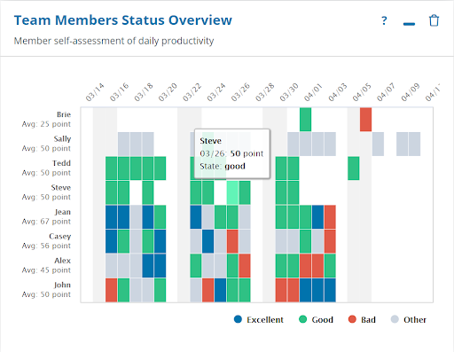
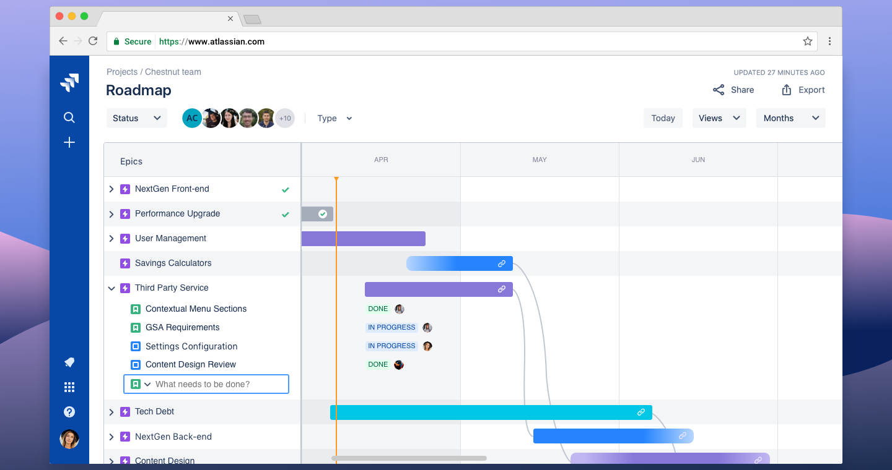
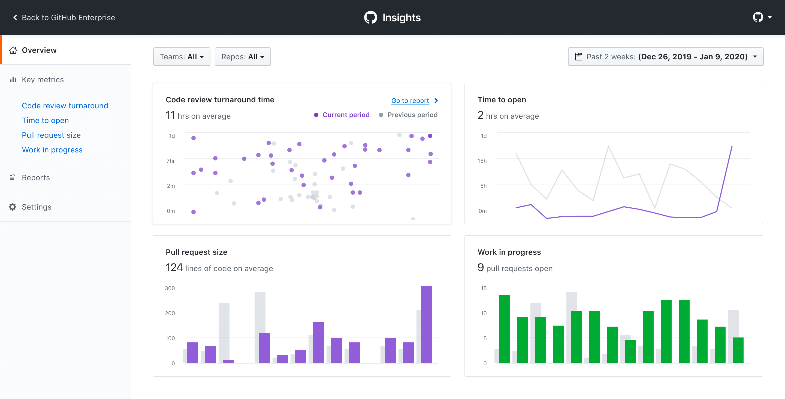

# Measuring Software Engineering

### Introduction
Measuring the capabilities of an employee is something trivial and obvious yet also very difficult to pinpoint the most effective way of doing so. It may be obvious for you or it may be something completely out of your realm of knowledge and capability but given the struggle so many have in measuring it meaningfully, it’s likely only obvious in hindsight. 

Managers in companies will often organise performance review meetings and other similar events in order to accurately measure an employee’s output. When we further narrow this down into the discipline of Software Engineering, we further make this question more difficult to answer.  Unlike some more traditional industries, the construction and study of metrics used to measure an employee is relatively straight forward but in software engineering there are first of all no obvious metrics which come to mind in order to form a meaningful analysis of an employee’s ability.

In the case of software engineering the ability to collect metrics in general is simple and routine due to the transparent nature of software engineering. Some of these metrics could be the total amount of commits, total amount of pull requests and total amount of lines of code written. These metrics each tell a story but none of them can accurately depict what is happening. In this report I will discuss several metrics which are used in the professional landscape of software engineering. I will highlight the flaws and positives of each metric and then outline case studies and discuss their findings followed by a conclusion.

## Metrics

### SOURCE LINES OF CODE (SLOC)
Also known as lines of code (LOC), is a very common software metric used to measure the size of a computer program by counting the total number of lines in the text of the program’s source code.  SLOC can be separated into two major types; physical SLOC and logical SLOC. 

* **Physical SLOC:** The most common definition of physical SLOC is a count of lines in the text of the program’s source code exempting the amount of comment lines. 

* **Logical SLOC:** Attempts to measure the number of executable statements.

Physical SLOC is much easier to measure as creating tools to measure physical SLOC is much easier. Physical SLOC’s definitions are also easier to explain. However, physical SLOC is not effective in cases of logically irrelevant formatting and conventions.
Logical SLOC is less sensitive to formatting and conventions but it is more complex to measure and create tools to measure. 

SLOC measures are usually stated without giving their definition and both measures often yield wildly different results. Here are some examples


**Example One:**
```java
for (int index = 0; index < 10; i++) System.out.println(“SLOC”); //This is a random comment
```

For this example:
* 1 physical line of code
* 2 logical lines of code
* 1 comment line


**Example Two:**
```java
//This is a random comment
for (int index=0; index<10;i++)
{
	System.out.println(“SLOC”);
}
```
For this example:
* 4 physical lines of code
* 2 logical lines of code
* 1 comment line

#### Does it work?
>”Using SLOC to measure software progress is like using kg for measuring progress on aircraft manufacturing” – Bill Gates

This quote sums up the essence of the argument against using SLOC as a relevant and meaningful metric in measuring the progress and productivity of software engineering. The total lines of code and total amount of statements is an irrelevant metric for measuring software engineering as it encourages bad practises such as:

* Copy-Paste-Syndrome
* Discourages refactoring to make things more streamlined and similar
* Adding lines of code which adds to complexity
* Added complexity means it is harder to understand
* Understanding takes time and costs productivity

An example of the bad practice that SLOC encourages:
```java
// Print the number 1
System.out.println(1);
// Print the number 2
System.out.println(2);
// Print the number 3
System.out.println(3);
// Print the number 4
System.out.println(4);
// Print the number 5
System.out.println(5);
// Print the number 6
System.out.println(6);
// Print the number 7
System.out.println(7);
// Print the number 8
System.out.println(8);
// Print the number 9
System.out.println(9);
// Print the number 10
System.out.println(10);
```
As you can decipher from the above code, it carries out a simple task of printing out the numbers 1 to 10. The SLOC of the above code regardless of physical or logical is 10. Both examples I gave earlier were more efficient ways of approaching this problem yet both have lower SLOC. Any software engineer manager would rather the examples earlier as opposed to the hard coding of the above example. This is a very simple way of highlighting the inefficiency and discrepancies of SLOC as a metric.

Using SLOC as a metric also has its down sides when you are evaluating using different programming languages as different languages require different amounts of lines of code to achieve the same amount of functionality. For instances higher level languages such as Python, Java and GO allow programmers to write useful applications with only a handful amount of lines of code whereas a lower level language such as C would require many more lines of code to achieve the same functionality.

SLOC is a valuable metric when combined along side other relevant metrics. As a single metric it does not paint a picture which is relevant to measure software engineering.

### ABC
The ABC software engineering was introduced by Jerry Fitzpatrick in 1997. Fitzpatrick decided to create ABC in order to overcome the drawbacks of SLOC as I stated above. The metric is used to define an ABC score as a triplet of values that represent the size of a group of source code statements.  The ABC score can be applied and evaluated to singular functions, classes, methods or files.

* **A:** The A is adding up the number of assignments in the program.

* **B:** The B is adding up the number of branches in the program.

* **C:** The C is adding up the number of conditionals in the program.

The ABC score is shown as a 3D vector or as a scalar value which is made up of the magnitude of the vector. 

#### Does it work?
The ABC metric can’t be used as a measure of productivity or effort. The value of A (Assignments) weighs very much in its calculation and the value of C (Conditions) are undervalued. The ABC metric is independent of the number of lines of code. The ABC metric is more oriented to the data than to the logic of the program. ABC struggles with different programming languages due to the syntax differences between these programming languages. For ABC to work effectively with some languages the metric needs to be tweaked in order to fulfil the goals of the metric. Furthermore, the ABC metric is unsuitable for non-imperative languages such as Prolog. This leaves us with a similar conclusion to SLOC as on its own ABC is not a very relevant metric, but it has use when used alongside other metrics.


On its own the ABC metric is not a relevant metric to measure software engineering. 

### CLOSED TICKETS
Closed tickets are the next metric I will discuss in this report. Many software projects are managed by a system that monitors work to be done with tickets for individual engineers. By counting and adding up every single ticket that is closed by a developer over a certain time period this metric will allow you to see how much progress and work is being closed off.


The metric of closed tickets requires tasks and jobs to be set out for individual software engineers. This adds complexity which must be accounted for when counting the tickets which are closed. The manager must assign tasks which are roughly worth the same amount of work for the metric to be in any way relevant to comparing engineers to each other.  One way of combatting this issue could be to score each ticket based on the amount of effort required to close it. This would alleviate the issue of unequal work loads for tickets and help better gauge the work being done. 


#### Does it Work?
Closed tickets as a relevant metric really comes down to how it is implemented and how well it is implemented and how equal the tickets are distributed. As I stated above, some tickets may take longer than others which can lead to differing amount of work earning different amounts of closed tickets. The way of scoring the tickets as stated above would remove this issue if carried out correctly. Closed Tickets does have the potential to simply become a list of tasks and it is possible that engineers could take advantage and close a considerably large amount of tickets and look productive and efficient without accomplishing much meaningful work.

In the end Closed Tickets as a metric is more effective and relevant than SLOC and ABC as it offers a more general and realistic view of the work achieved by individual engineers. The main downside of Closed Tickets as a metric is the work that is added to the managers table due to the complexity of implementing it in an effective way.


### ITEMS COVERED IN A STAND-UP MEETING
Items covered in a stand-up meeting is the last metric I will be discussing in this report. Software engineering teams will usually have daily stand-up meetings. These meetings will usually cover questions such as; What did you get done yesterday? What are you going to do today? What challenges are you facing? These questions are quite mondain, but they can be used to gauge engineer productivity. For instance, if an engineer is regularly completing the tasks they set out in the stand-up meeting, this shows consistency and productivity. 


When it comes to items covered in a stand-up meeting as a metric it needs to be recorded. One way of doing this is having someone record everything stated in the meetings. Then a manager could review what was said in past meetings to measure the productivity of the engineers. Another way to measure this as a metric is to use a software tool to help measure this. Some of these tools include Geekbot and Sleeek which are both bots for Slack. They perform simple surveys and keep track of employees and their respective tasks.




#### Does it Work?
Once again, the metric comes down to how it is implemented. I mentioned above two of the ways a manger could implement and record this metric. The former being using notes from the stand-up meetings and review these notes to draw their own conclusions. The main problem with this approach is it could lead to the slowing down of the daily stand-up meetings. It also is a very public way of measuring engineering productivity and some members of a team might not feel comfortable discussing why they haven’t completed a given task.

Another issue with this metric is that an engineer could be overly optimistic with their predictions. They could bite of more than they can chew per se. For this metric to me truly relevant a manager will need to create a safe environment for their team to speak out.

In conclusion, this metric relies heavily on accountability and honesty of team members, but it is very conclusive in showing the productivity of the engineers in question.

## Third-Party Tools
Managers have a set of tools available to them to measure software engineers. These tools can move the workload from the manager who might have to analyse and inspect individual’s code or writing a report. There is a plethora of tools available to do this and it is up to the project managers to use these tools. I will discuss **four** of these tools below. The tools I will be discussing are; Jira, Timeular, GitHub Insights and Humanyze. 

### JIRA
Jira is a proprietary issue tracking software developed by Atlassian. It allows its users track bugs and gives them agile project management abilities. The software gets its name from the Japanese word for Godzilla, Gojira. It is used across a vast amount companies in the software development world. Its main use is to streamline and optimise existing workflows. It does however have many tools and features that allow users to measure software engineering.




Jira has a scrum board feature that allows teams and groups to focus on delivering iterative and incremental value this increasing productivity within the team and the volume of output produced by the team. Jira also has a roadmap feature to allow sculpt a bigger picture for team members to join in and stay on top of and engage in.  Jira has many tools and features to help visualise reporting and goals of teams such as Sprint Reports, Velocity Charts and Burndown/up charts.

### TIMEULAR
Timeular is a time management tool which is used by Google, KPMG and Audi. This tool, however, is not a software solution. It is a hardware solution with supporting software. Immediately the advantage of taking a tool off a computer and into the real world assists in productivity and workflow for engineers not needing to have multiple tools open. The piece of hardware which Timeular produce is a unique 8-sided die which allows users to draw symbols or words on each side. The user will then flip up the die to whatever task they are currently undergoing. The data is then recorded and visualised in an app. 


The data recorded from the use of this die can be viewed by the project manager in order to visualise where his engineers are spending their time and they can use this to increase productivity of their team.


### GITHUB INSIGHTS
GitHub is one of the most popular third-party software used by software engineers around the world. GitHub at its core is a version control software which allows for the control and management of codebases. It has various other features as well as its core. The main feature used by managers to manage software engineers is GitHub’s Insights tab on repositories. This feature gives users access to the amount of pull requests which have been merged, the amount of closed issues and new issues. 




Managers also have access to a breakdown of individual metrics such as lines added and removed and total commits. Insights allows mangers to view a timeline of the most recent commits and allows for the tracking of different branches. 


### HUMANYZE
Humanyze is a people analytics software provider. It is based on research and findings from the MIT Media Lab. Humanyze Elements is the product which allows for the measuring of software engineering. Humanyze uses communication data to uncover patterns on how work gets done in teams and companies. Project managers can use this data to analyse their employee’s productivity and workload in real time and may help them make better decisions. 


The actual software is a web-based dashboard. The sources which can be used include Google Suite, Office Exchange, Skype and Humanyze Badge.


## Ethical Considerations

